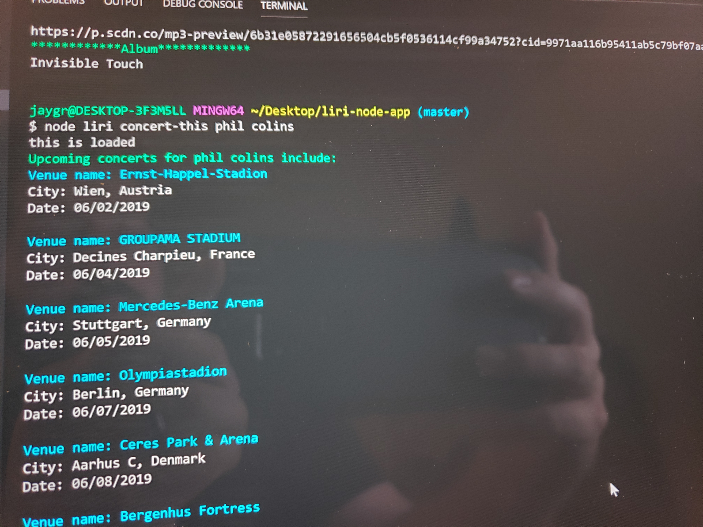

# liri-node-app
We are creating a siri style app.

If you type Movie this it will give you a default movie and infomation

If you type movie this with a title it will give you information on that movie

if you type spotify this it will give you information about that band or artist

Finaly if you type concert this it will give you concert information on the artist or band that is entered on  that line.

